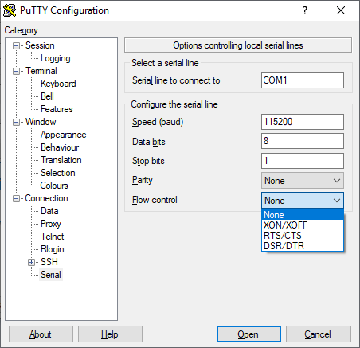

Getting started on LS1012 Grapeboard
============

This document will walk you through building all components from source and developing OP-TEE TA's for [Scalys Grapeboard](https://www.grapeboard.com/). The components we will build are

 - RCW, PBL, and U-Boot
 - PPA (Primary Protected Application)
 - OP-TEE
 - Linux

## Reference

 - [Scalys Grapeboard Home](https://www.grapeboard.com/)
 - [LSDK (Layerscape SDK)](https://www.nxp.com/products/processors-and-microcontrollers/arm-based-processors-and-mcus/qoriq-layerscape-arm-processors/layerscape-software-development-kit-v18.09:LAYERSCAPE-SDK)
 - [LSDK Documentation (PDF)](https://www.nxp.com/docs/en/supporting-information/LSDK_REV18.09.pdf)
 - [LSDK Git Repositories](https://lsdk.github.io/components.html)
 - [Grapeboard BSP User Guide (PDF)](https://www.grapeboard.com/wp-content/uploads/2018/10/Scalys_Grapeboard-bsp-user-guide_18102018.pdf)

# Setting up your Grapeboard

You will need

 - 5-15V power supply
 - micro USB cable
 - 8GB or greater micro SD card
 - A physical machine with USB port running [Ubuntu 18.04 LTS](http://releases.ubuntu.com/18.04/)

You will interact with the device over the serial terminal, and eventually the network. U-Boot, PPA, and OP-TEE are stored on on-board NOR flash, and linux will be stored on the SD card.

## Serial Terminal

1. Connect the micro USB cable to the micro USB connector (next to the power connector). Your PC should recognize it as a USB/Serial device. If it does not, you can try the driver [here](https://www.silabs.com/products/development-tools/software/usb-to-uart-bridge-vcp-drivers).
2. Determine the COM port number from device manager.
3. Open a putty terminal at 115200 8N1. You must go to **Connection -> Serial** and set **Flow control** to **None**.

4. Power on the board by plugging in the power supply.

You should see spew from the bootloader in your putty terminal.

```
U-Boot 2017.11-00009-g5418f2df0d5-dirty (Oct 16 2018 - 17:37:42 -0700)

SoC:  LS1012AE Rev1.0 (0x87040010)
Clock Configuration:
       CPU0(A53):800  MHz
       Bus:      250  MHz  DDR:      1000 MT/s
Reset Configuration Word (RCW):
       00000000: 08000008 00000000 00000000 00000000
       00000010: 33050000 c000400c 40000000 00001800
       00000020: 00000000 00000000 00000000 000047d0
       00000030: 00000000 10c02120 00000096 00000000
I2C:   ready
...
```

Congratulations, you're ready to run commands at the U-Boot prompt.

# Install prerequisites

```
sudo apt install build-essential gcc-aarch64-linux-gnu g++-aarch64-linux-gnu u-boot-tools device-tree-compiler

```

# Building RCW, PBL, and U-Boot

U-Boot is built outside the flexbuild environment. Our branch is forked from the `scalys-lsdk-1803` branch of `git://git.scalys.com/lsdk/u-boot`. Our branch is `https://github.com/ms-iot/SolidRun-u-boot.git` branch `ms-iot-grapeboard`.

```
git clone https://github.com/ms-iot/SolidRun-u-boot.git -b ms-iot-grapeboard
cd SolidRun-u-boot
export ARCH=aarch64
export CROSS_COMPILE=aarch64-linux-gnu-
make grapeboard_pcie_qspi_spl_defconfig
make
```

It will produce a file named `u-boot-with-spl-pbl.bin`. This file must be written to NOR flash.

## Updating U-Boot on NOR Flash

Copy `u-boot-with-spl-pbl.bin` to the root of a FAT-formatted SD card.

Boot into [recovery U-Boot](#booting-grapeboard-into-recovery-mode), then run the following u-boot commands:

```
mmc rescan
fatload mmc 0:1 $load_addr u-boot-with-spl-pbl.bin
sf probe 0:0
sf erase u-boot 200000
sf write $load_addr u-boot $filesize
```

Reset the board. When it reboots, you should see it execute your U-Boot.

# Building PPA and OP-TEE

NXP maintains an OP-TEE fork at `https://source.codeaurora.org/external/qoriq/qoriq-components/optee_os`, which is up to date with `https://github.com/OP-TEE/optee_os` as of tags/LSDK-18.09`. We build OP-TEE out of `https://github.com/ms-iot/optee_os.git` branch `ms-iot`. The flexbuild enviorment described bellow will clone this correct branch of OP-TEE for you.

Everything but U-Boot is built in the "flexbuild" environment, an abomination developed by NXP. The LSKD repository is forked from flexbuild. The first step in running commands in flexbuild is to cd to the root of this repository and source the `setup.env` script.

```
git clone https://github.com/ms-iot/lsdk.git
cd lskd
source setup.env
```

Then, you can run `flex-builder` to build the PPA+OP-TEE combined FIT image.

```
flex-builder -c ppa-optee -m ls1012grapeboard
```

It will produce the file `build/firmware/ppa/soc-ls1012/ppa.itb`. This file must be written to NOR flash.

## Updating PPA and OP-TEE on NOR Flash

Copy `ppa.itb` to the root of a FAT-formatted SD card.

Boot into [recovery U-Boot](#booting-grapeboard-into-recovery-mode), then run the following u-boot commands:

```
mmc rescan
fatload mmc 0:1 $load_addr ppa.itb
sf probe 0:0
sf erase ppa 100000
sf write $load_addr ppa $filesize
```

Reset the board. When it reboots, you should see output like the following, which indicates that you successfully updated PPA and OP-TEE.

```
PPA Firmware: Version LSDK-18.09
SEC Firmware: 'loadables' present in config
loadables: 'trustedOS@1'
```

# Building Linux

Linux is the combination of NXP's layerscape fork (`https://source.codeaurora.org/external/qoriq/qoriq-components/linux` `tags/LSDK-18.09-V4.14`) and grapeboard patches. Grapeboard patches were taken from `git://git.scalys.com/lsdk/linux` branch `grapeboard-proto`. The grapeboard patches have been rebased on top of `tags/LSDK-18.09-V4.14`, and the result is stored at `https://github.com/ms-iot/linux.git` branch `ms-iot-grapeboard`.

```
flex-builder -c linux -a arm64 -m ls1012grapeboard
flex-builder -i mkrfs -a arm64
flex-builder -i mkbootpartition -m ls1012grapeboard -a arm64
flex-builder -c optee_client -a arm64
flex-builder -c optee_test -a arm64
flex-builder -i merge-component -a arm64 -m ls1012grapeboard
```

This will create a boot partition tarball (`build/images/bootpartition_arm64_<version>.tgz`) and rootfs (`build/rfs/rootfs_ubuntu_bionic_arm64`). We will use the `flex-installer` script to apply them to an SD card.

## Installing Linux to the SD card

You will need a physical linux machine and an 8GB or larger SD card.

Run the following command, where `/dev/sdx` is your SD card. All data on the card will be lost.

```
flex-installer -b build/images/bootpartition_arm64_<version>.tgz -r build/rfs/rootfs_ubuntu_bionic_arm64 -d /dev/sdx
```

If you receive the error `mkfs.vfat: unable to open /dev/sdx1: No such file or directory`, but are able to view the directory in your terminal, add `sleep 5` to `tools/flex-installer` after `echo "Formatting partitions ..."` and before `sudo mkfs.vfat -n EFI /dev/${devpartname}1`

Unmount and eject the SD card.

```
udisksctl unmount -b /dev/sdx1
udisksctl unmount -b /dev/sdx2
udisksctl unmount -b /dev/sdx3
udisksctl power-off -b /dev/sdx
```

Insert the SD card to your grapeboard and power on. You should see linux boot. You can log in and interact with the device over the serial terminal. The login credentials are:
```
Username: root
Password: root
```

### Enabling network and SSH

Networking is not configured by default. Until we figure out how to provision the image with networking, use the following commands to enable networking. This only needs to be done once.

```
echo "auto eth0" >> /etc/network/interfaces
echo "iface eth0 inet dhcp" >> /etc/network/interfaces
ifup -a
```

Enable root to login over SSH, and restart SSH server.

```
echo "PermitRootLogin yes" >> /etc/ssh/sshd_config
service sshd restart
```

Wait a little bit for the device to acquire an IP address, then determine the device's IP by running:

```
ifconfig eth0
```

You can now SSH into the device using it's IP address, and `root/root` as login credentials.

# Running OP-TEE tests

This will run the OP-TEE test suite, which will verify that Linux can talk to OP-TEE.

```
tee-supplicant &
xtest -l 0
```

You should see most of the tests pass:

```
...
+-----------------------------------------------------
16081 subtests of which 1 failed
74 test cases of which 1 failed
0 test case was skipped
TEE test application done!
```

# Developing OP-TEE TA's

1. Build optee\_os and optee\_client.
	```
	flex-builder -c optee_os -m ls1012grapeboard -a arm64
	flex-builder -c optee_client -m ls1012grapeboard -a arm64
	```
1. Set required environment variables.
	```
	export TA_DEV_KIT_DIR=$PWD/packages/apps/optee_os/out/arm-plat-ls/export-ta_arm64/
	export TEEC_EXPORT=$PWD/build/apps/components_arm64
	export HOST_CROSS_COMPILE=aarch64-linux-gnu-
	```
1. Change directories outside this repository, and clone `optee_examples`.
	```
	cd ..
	git clone https://github.com/linaro-swg/optee_examples.git
	```
1. Build the hello\_world TA and host app.
	```
	cd optee_examples/hello_world
	make
	```
1. Copy host executable and TA to target.
	```
	scp host/optee_example_hello_world root@<ip>:~
	scp ta/*.ta root@<ip>:~
	```
1. On the target, copy the `.ta` file to `/lib/optee_armtz`.
	```
	cp *.ta /lib/optee_armtz
	```
1. On the target, open a separate SSH window, and start the supplicant.
	```
	tee-supplicant
	```
1. In another window on the target, run the host executable.
	```
	./optee_example_hello_world
	```

You should see the following printed from the host executable:
```
root@localhost:~# ./optee_example_hello_world
Invoking TA to increment 42
TA incremented value to 43
```

And the following from the supplicant window:
```
root@localhost:~# tee-supplicant
D/TA:  TA_CreateEntryPoint:39 has been called
D/TA:  TA_OpenSessionEntryPoint:68 has been called
I/TA:  Hello World!
D/TA:  inc_value:105 has been called
I/TA:  Got value: 42 from NW
I/TA:  Increase value to: 43
I/TA:  Goodbye!
D/TA:  TA_DestroyEntryPoint:50 has been called
```

# Booting Grapeboard into recovery mode

These instructions taken from section 5.3 of the [Grapeboard BSP User Guide](https://www.grapeboard.com/wp-content/uploads/2018/05/scalys_grapeboard_bsp_user_guide_180518.pdf).

1. Connect the Grapeboard to your host PC and open a serial terminal at 115200 8N1. If you're using Putty on Windows, you must go to **Connection -> Serial** and set **Flow control** to **None**.

1. Press and hold switch `S2` on the Grapeboard.
1. Power-up (or reset with switch `S1`) the Grapeboard
1. Release switch `S2` once U-boot prints the message: `Please release the rescue mode button (S2) to enter the recovery mode`

You can now issue commands at the U-Boot prompt.

